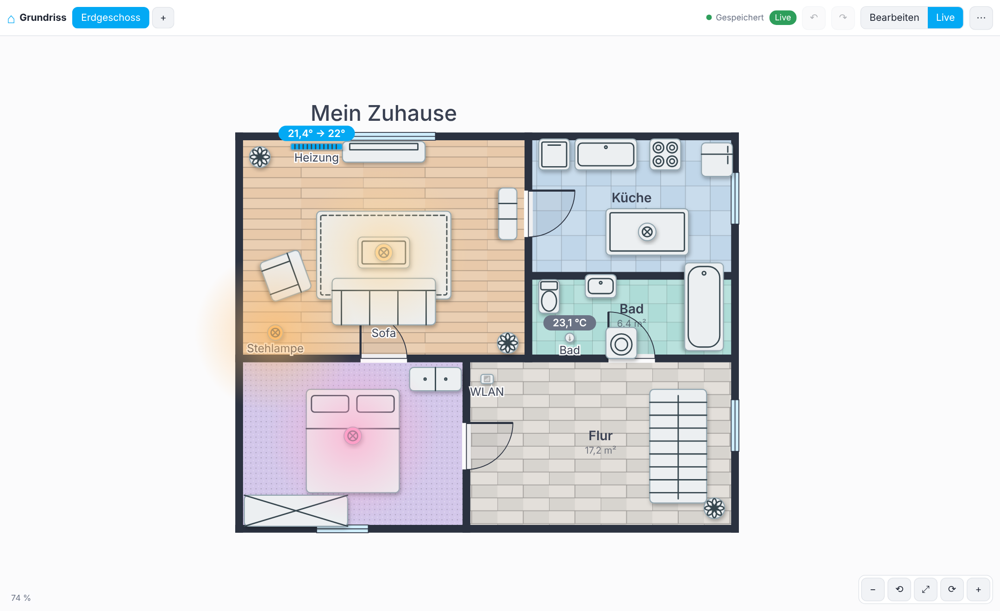
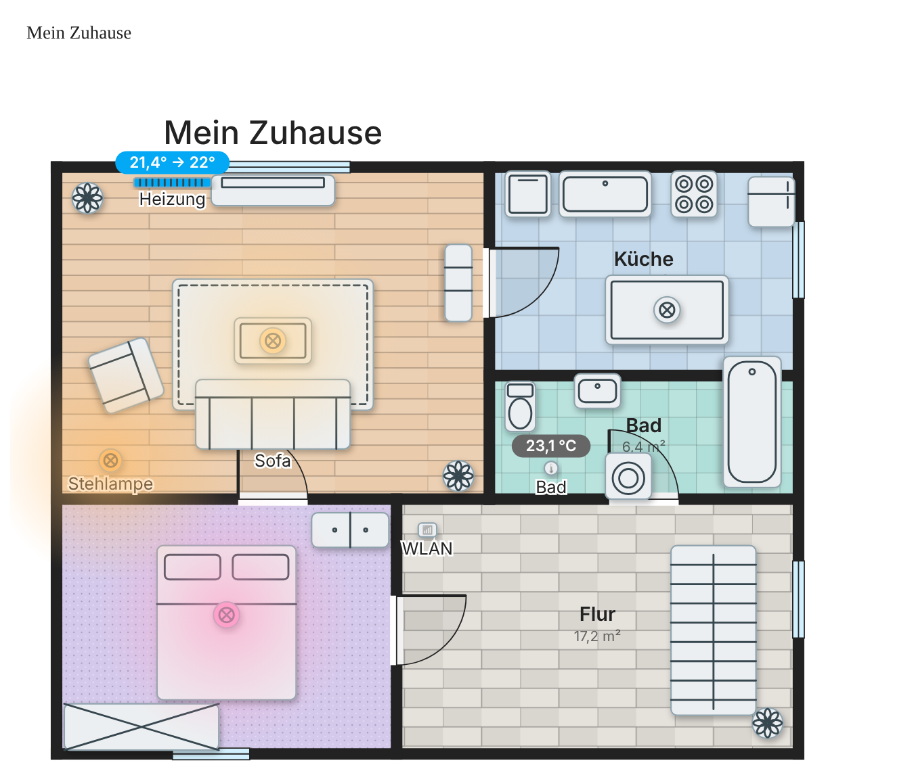

<p align="center"></p>

# Floorplan Studio für Home Assistant (HACS)

Zeichne deinen Grundriss direkt in Home Assistant – Wände, Räume, Türen, Fenster, Lampen, Möbel, Heizungen, Sensoren … alles frei konfigurierbar – und nutze ihn als **Live-Dashboard**: Lampen leuchten, Heizungen zeigen die Temperatur, Tippen schaltet.


| Live-Modus | Dashboard-Karte |
|---|---|
|  |  |

## Installation über HACS

1. HACS → ⋮ (oben rechts) → **Benutzerdefinierte Repositories**
2. Repository-URL: `https://github.com/Hettinger91/Floor-Planer-2D-Home-assistant`, Typ: **Integration** → Hinzufügen
3. „Floorplan Studio“ in HACS suchen → **Herunterladen**
4. Home Assistant **neu starten**
5. *Einstellungen → Geräte & Dienste → Integration hinzufügen → Floorplan Studio* (ein Klick, keine Einstellungen)

Danach erscheint in der Seitenleiste der Eintrag **Grundriss**.

> Hinweis: HACS kann keine Supervisor-Apps (Add-ons) installieren. Deshalb ist Floorplan Studio eine Integration – sie bringt das Panel, die Speicherung und die Dashboard-Karte selbst mit und läuft auch ohne Supervisor (Docker, Core, HAOS).

### Manuell (ohne HACS)
Ordner `custom_components/floorplan_studio` nach `<config>/custom_components/` kopieren, neu starten, Integration hinzufügen.

## Entitäten verknüpfen
* Objekt auswählen → **Auswählen …** öffnet eine Suche mit Filter nach Typ und Bereich.
* Tab **Entitäten** links: Zeile auf den Plan ziehen oder mehrere ankreuzen und platzieren – Objekttyp, Beschriftung, Wertanzeige und Leuchten werden automatisch gesetzt.

## Individuell gestalten
* **Symbol-Stil** (Einstellungen → Ansicht): Modern-neutral (Standard), Klassisch (Architektenplan), Farbig-dezent oder Emojis. Eigene Icons und Bilder pro Objekt bleiben möglich und haben Vorrang vor dem Symbol.
* Jeder Raum: Farbe, **Bodenbelag** (Holz, Fliesen, Stein, Teppich, Rasen, Beton) mit Größe und Drehung des Musters.
* Jedes Objekt: Farbe, Form, Größe, Symbol, Beschriftung, Leuchtfarbe; eigene Objekttypen in der Bibliothek; Schatten global schaltbar.
* Wände (Farbe, Dicke, gestrichelt), Türen/Fenster, Hintergrundbild als Vorlage, mehrere Etagen.

## Ansicht drehen
Am Tablet mit zwei Fingern drehen und zoomen; am PC mit Rechtsklick-Ziehen, Shift+Mausrad, den Tasten Q/E oder den Knöpfen ⟲ ⟳ (90°). **Dashboard-Karte:** Mit einem Finger/der Maus ziehen = Ansicht um die Mitte drehen (Orbit), zwei Finger = zoomen + drehen + verschieben, Shift-/Rechts-Ziehen = verschieben, Strg+Mausrad = zoomen, Shift+Mausrad = drehen, Doppelklick = zurücksetzen; Knöpfe unten rechts. Antippen von Objekten schaltet wie gewohnt. Abschalten mit `gestures: false`. **Editor:** Knopf ◎ schaltet den Dreh-Modus (Ein-Finger-/Maus-Ziehen dreht statt zu verschieben). Längen werden in **Metern** eingegeben (Einstellung „Einheit“ → cm möglich). In den Einstellungen kann die Drehung als **Ausrichtung** gespeichert werden – sie gilt dann auch auf der Dashboard-Karte (oder per `rotate:` in der Karte).

## Feinschliff pro Objekt / Raum
* **Bezeichnung** lässt sich direkt im Plan über den kleinen Griff am Text drehen (Objekt anklicken), **Wert/Zustand** (die Kapsel über dem Objekt) ebenfalls über einen Griff im Plan. Mit „Bezeichnung = Name der Entität“ übernimmt der Plan den Namen automatisch aus Home Assistant.
* **Leuchten, wenn aktiv:** Effekt (weich, stark, Ring, pulsierend), **Leuchtradius** und **Intensität** einstellbar.
* **Raum:** Breite, Tiefe und Position als Zahlen ändern – Wände an den Raumecken wandern mit.

## Objekte & eigene Symbole
Die Bibliothek enthält über 260 Objekte (Möbel, Küche & Bad, Heizung & Klima, rund 75 Smart-Home-Geräte, Büro & Medien, Außen & Garage, Kinder & Haustiere, Bau & Deko). Mit **+ Eigenes** legst du eigene Objekte an – mit **Icon (Emoji)**, **Bild** (z. B. Draufsicht, Upload oder URL) oder beidem; das Bild lässt sich eingepasst, gestreckt oder ohne Fläche darstellen. Jedes platzierte Objekt kann im Inspektor ebenfalls ein eigenes Icon/Bild bekommen, und über „Als Vorlage speichern“ wird es zur wiederverwendbaren Vorlage.

## Garten

Oben in der Etagenleiste **🌿+** = Garten-Ebene hinzufügen: Rasenfläche, blasser Hausumriss zur Orientierung, Wände werden zu Zäunen. Bodenarten für Flächen: Rasen, Kies, Pflaster, Holzdeck, Sand, Erde, Wasser. Kategorie **Garten** in der Bibliothek mit ~100 Objekten (Bäume, Beete, Teich, Gewächshaus, Pergola, Möbel, Wege, Leuchten, Mähroboter, Bewässerung, Sensoren …). In 3D steht der Garten immer um das Haus herum.

## 3D-Ansicht

Im Editor oben **2D | 3D** umschalten, in der Karte der Button **3D** in der Seitenleiste (`view3d: false` blendet ihn aus, `mode3d: true` startet direkt in 3D).
**Editor:** Die Seitenleisten sind in einklappbare Abschnitte gegliedert (Zustand wird gemerkt); Objektkategorien sind eingeklappt, bei der Suche automatisch offen.
**Blueprint:** Button „Blueprint“ im Editor (2D + 3D) bzw. in der Seitenleiste der Karte; Karte: `blueprint: true`. **3D-Neigen:** In 3D lässt sich senkrecht fast bis zur Draufsicht kippen; per Touch mit dem Seitenleisten-Button „Neigen ↕“ (blockiert dann das Scrollen über dem Bild; Standard: an ab 640 px Kartenbreite, Option `tilt3d: true/false`).

* Realistischer Look (Tag/Nacht): Himmel, Sonnenlicht mit Schatten, Rasen, Bodenmuster, Wände mit Fenster-/Türöffnungen
* Über 270 echte 3D-Modelle (Möbel, Küche, Bad, Heizung, Lampen, Steckdosen/Schalter, Kameras, Sensoren, Geräte, Treppen, Auto, Bäume, Pool …); Smart-Home-Teile leuchten bzw. zeigen ihren Zustand
* Aktive Lampen leuchten (Lichtkegel + Glow), Wände zur Kamera werden automatisch abgesenkt (Wände: automatisch / voll / halb / flach)
* Look: Auto · Tag · Dunkel · Neon; „alle Etagen“ stapelt die Etagen
* Bedienung: Ziehen = Orbit, Zwei-Finger = Zoom/Verschieben/Drehen, Tippen = Objekt schalten (Live), Doppeltipp = Ansicht zurücksetzen
* Dach (Flach-, Sattel-, Walmdach) mit Farbe, Neigung und Überstand; Wandfarbe, Wandhöhe und Wiesenfarbe einstellbar (Leiste im 3D-Editor oder Inspektor „3D-Ansicht“); Karte: `roof3d`, `wall_color3d`
* Objekte direkt in 3D bearbeiten: in der Bibliothek ein Objekt wählen und in die 3D-Szene tippen; ausgewähltes Objekt (blauer Rahmen) per Ziehen verschieben
* ☀ Solar: Panels auf dem Dach, Energie fließt animiert ins Haus; Anzahl der Module frei wählbar (Panels passen sich dem Dach an, Überlauf auf die Gegenseite), optional Leistungs-Entität (Inspektor „3D-Ansicht“) steuert Tempo
* Dacheindeckung **glatt oder Dachziegel**; Etagen und Dach schließen bündig an
* Look **Live (Zeit & Wetter)**: Sonnen-/Mondstand und Himmel nach Tageszeit (nutzt `sun.sun`, sonst die Uhrzeit) und aktuelles Wetter aus einer `weather.*`-Entität (automatisch die erste, oder Inspektor „Wetter-Entität“ / Karte `weather3d: weather.home`): Sonne, Wolken, Regen, Schnee (Schneedecke), Nebel, Gewitter mit Blitzen, Wind – alles animiert, Lampen gehen nachts stärker an. Karte: `look3d: live`
* Garten: Terrassen mit Platten (40/60 cm, Naturstein), Pavillons, Zier- und Wandbrunnen, Kugelgrill, Steg, Gartenbrücke, Strandkorb
* Saug-, Mäh- und Poolroboter fahren animiert umher (nur wenn die Entität aktiv ist; ohne Entität stehen sie still, außer am Objekt ist „Immer“ gewählt)
* Rollläden, Markisen, Vorhangmotoren fahren animiert hoch/runter passend zum Cover-Zustand (Position oder offen/geschlossen); Rasensprenger und Springbrunnen sprühen, solange die Entität an ist; Deckenventilator dreht sich
* Höhen pro Objekt im Inspektor („3D-Höhe“, „Höhe über Boden“), Wandhöhe pro Etage
* Karten-Optionen: `look3d` (auto, day, dark, live, neon, blueprint), `weather3d`, `walls3d`, `all3d`, `height3d` (px)
* Rollläden/Garagentore: beim Hochziehen/Herunterziehen in 3D erscheint neben dem Finger/Mauszeiger eine Prozentanzeige. Türen/Fenster zeigen „offen“ (2D+3D), sobald die zugewiesene Entität (z. B. Kontaktsensor `binary_sensor`) `on` ist.
* Layout: `layout: auto` (Standard: bei ≥ 640 px Kartenbreite Etagen/2D-3D/Wandansicht als Seitenleiste links, sonst als Leiste oben), `side` oder `top`. Tipp: Ansichtstyp „Panel (1 Karte)“ oder Sections-Karte mit voller Breite (12 Spalten) + `height3d` für eine große Darstellung.

3D-Darstellung mit [three.js](https://threejs.org) (MIT, gebündelt in `frontend/vendor/`, Lizenz in `THREE-LICENSE.txt`).

## Benutzung

* **Panel „Grundriss“**: Zeichnen (Wand, Raum, Objekte aus der Bibliothek, eigene Objekte), Entitäten verknüpfen, **Live**-Modus zum Bedienen.
* **Dashboard**: Im Panel *Menü (⋯) → Dashboard in Home Assistant …* legt mit einem Klick ein Dashboard „Grundriss“ an (optional in der Seitenleiste). Oder in jedes Dashboard eine Karte einfügen:

```yaml
type: custom:floorplan-studio-card
# floor: Erdgeschoss   # optional: feste Etage (Name oder ID); sonst Etagen-Tabs
# title: Mein Haus     # optional
# gestures: false     # optional: Touch-/Maus-Gesten abschalten (Seite scrollt dann normal)
# rotate: 90           # optional: Drehung in Grad (sonst die im Editor gespeicherte Ausrichtung)
```

* Tippen auf ein Objekt schaltet (Lampen, Schalter, Szenen …), langes Drücken öffnet die Detailansicht – umstellbar in den Einstellungen. Klima, Sensoren u. a. öffnen die Details.
* Der Plan wird in Home Assistant gespeichert (`.storage/floorplan_studio.plan`) und ist damit Teil deiner Backups; zusätzlich gibt es automatische Sicherungen im Menü (*Sicherungen …*).

## Rechte & Datenschutz
* **Bearbeiten, Hochladen, Dashboard anlegen**: nur Administratoren. Alle anderen Benutzer sehen den Plan im Live-Modus und können schalten.
* Hochgeladene Hintergrundbilder liegen in `<config>/floorplan_studio/media/` und sind unter einer nicht erratbaren URL abrufbar (ohne Anmeldung, wie bei `/local`).

## Entwicklung
Der Editor liegt in `custom_components/floorplan_studio/frontend/app`. Die Dashboard-Karte (`frontend/floorplan-card.js`) wird aus denselben Quellen gebaut:

```
python3 tools/build_card.py
```

* Neue Etagen übernehmen Wände und Räume der ersten Etage (deckungsgleich). Die Karte hat nur noch einen 2D/3D-Umschalter; in 3D dreht man 360° per Maus/Touch (Ziehen), Zoom per Pinch bzw. Strg+Mausrad.
* Saugroboter fahren in Bahnen hin und her (Hindernisse werden umfahren); Mähroboter fahren nur auf Rasenflächen im Garten, nie ins Haus, auf Terrasse/Kies/Wasser oder über Objekte.

## Sprachen

Deutsch, English, Schwiizerdütsch, Français, 中文, 日本語, Nederlands, Dansk, Suomi, Polski, Русский, Italiano, Español, Português, Svenska, हिन्दी. Die Sprache folgt automatisch der Home-Assistant-Sprache; sie lässt sich im Editor (Inspektor „Ansicht & Raster“ → Sprache) oder in der Karte per `language: ja` (usw.) festlegen. Übersetzungen liegen in `frontend/i18n/<code>.json` (Schlüssel = deutscher Text).

## Öffnungen, Tore und Bereiche

* Fenster, Türen, Schiebetüren und Garagentore zeigen in 2D und 3D ihren Zustand: geschlossen, offen oder (Fenster) gekippt – abhängig von der Entität (`binary_sensor`, `cover`; Position `current_position` wird übernommen). Optional gibt es pro Fenster/Tür eine zweite „Kipp-Entität“ (an = gekippt).
* Rollläden, Raffstores, Markisen, Vorhänge und Garagentore (Cover-Entitäten) lassen sich in der 3D-Ansicht (Live) anklicken und nach oben/unten ziehen: Position wird gesetzt, bei Toren ohne Positionsunterstützung wird geöffnet bzw. geschlossen.
* Räume können einem Home-Assistant-Bereich zugewiesen werden (Inspektor → Raum → „Bereich“): der Name wird übernommen, im Live-Plan zeigt der Raum Temperatur, Luftfeuchte, Lichter an/gesamt und offene Fenster/Türen des Bereichs; Tippen auf den Raum schaltet die Lichter des Bereichs.
