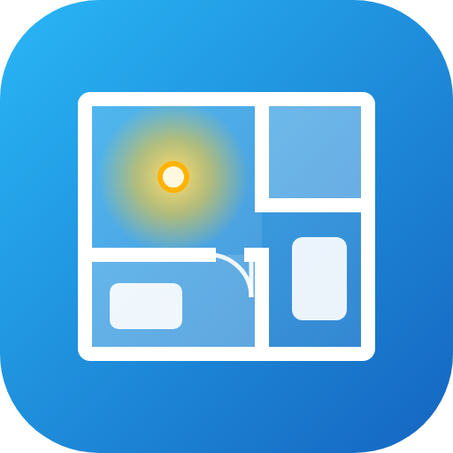
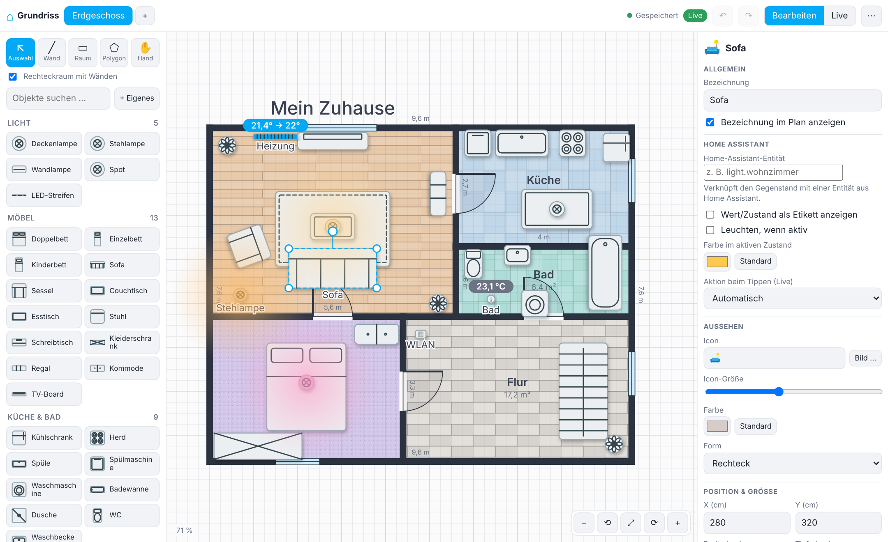

<p align="center"></p>

# Floorplan Studio für Home Assistant (HACS)

Zeichne deinen Grundriss direkt in Home Assistant – Wände, Räume, Türen, Fenster, Lampen, Möbel, Heizungen, Sensoren … alles frei konfigurierbar – und nutze ihn als **Live-Dashboard**: Lampen leuchten, Heizungen zeigen die Temperatur, Tippen schaltet.



| Live-Modus | Dashboard-Karte |
|---|---|
|  |  |

## Installation über HACS

1. HACS → ⋮ (oben rechts) → **Benutzerdefinierte Repositories**
2. Repository-URL: `https://github.com/Hettinger91/Floor-Planer-2D-Home-assistant`, Typ: **Integration** → Hinzufügen
3. „Floorplan Studio“ in HACS suchen → **Herunterladen**
4. Home Assistant **neu starten**
5. *Einstellungen → Geräte & Dienste → Integration hinzufügen → Floorplan Studio* (ein Klick, keine Einstellungen)

Danach erscheint in der Seitenleiste der Eintrag **Grundriss**.

> Hinweis: HACS kann keine Supervisor-Apps (Add-ons) installieren. Deshalb ist Floorplan Studio eine Integration – sie bringt das Panel, die Speicherung und die Dashboard-Karte selbst mit und läuft auch ohne Supervisor (Docker, Core, HAOS).

### Manuell (ohne HACS)
Ordner `custom_components/floorplan_studio` nach `<config>/custom_components/` kopieren, neu starten, Integration hinzufügen.

## Entitäten verknüpfen
* Objekt auswählen → **Auswählen …** öffnet eine Suche mit Filter nach Typ und Bereich.
* Tab **Entitäten** links: Zeile auf den Plan ziehen oder mehrere ankreuzen und platzieren – Objekttyp, Beschriftung, Wertanzeige und Leuchten werden automatisch gesetzt.

## Individuell gestalten
* **Symbol-Stil** (Einstellungen → Ansicht): Modern-neutral (Standard), Klassisch (Architektenplan), Farbig-dezent oder Emojis. Eigene Icons und Bilder pro Objekt bleiben möglich und haben Vorrang vor dem Symbol.
* Jeder Raum: Farbe, **Bodenbelag** (Holz, Fliesen, Stein, Teppich, Rasen, Beton) mit Größe und Drehung des Musters.
* Jedes Objekt: Farbe, Form, Größe, Symbol, Beschriftung, Leuchtfarbe; eigene Objekttypen in der Bibliothek; Schatten global schaltbar.
* Wände (Farbe, Dicke, gestrichelt), Türen/Fenster, Hintergrundbild als Vorlage, mehrere Etagen.

## Ansicht drehen
Am Tablet mit zwei Fingern drehen und zoomen; am PC mit Rechtsklick-Ziehen, Shift+Mausrad, den Tasten Q/E oder den Knöpfen ⟲ ⟳ (90°). **Dashboard-Karte:** Mit einem Finger/der Maus ziehen = Ansicht um die Mitte drehen (Orbit), zwei Finger = zoomen + drehen + verschieben, Shift-/Rechts-Ziehen = verschieben, Strg+Mausrad = zoomen, Shift+Mausrad = drehen, Doppelklick = zurücksetzen; Knöpfe unten rechts. Antippen von Objekten schaltet wie gewohnt. Abschalten mit `gestures: false`. **Editor:** Knopf ◎ schaltet den Dreh-Modus (Ein-Finger-/Maus-Ziehen dreht statt zu verschieben). Längen werden in **Metern** eingegeben (Einstellung „Einheit“ → cm möglich). In den Einstellungen kann die Drehung als **Ausrichtung** gespeichert werden – sie gilt dann auch auf der Dashboard-Karte (oder per `rotate:` in der Karte).

## Feinschliff pro Objekt / Raum
* **Bezeichnung** und **Wert/Zustand** lassen sich beliebig drehen (°).
* **Leuchten, wenn aktiv:** Effekt (weich, stark, Ring, pulsierend), **Leuchtradius** und **Intensität** einstellbar.
* **Raum:** Breite, Tiefe und Position als Zahlen ändern – Wände an den Raumecken wandern mit.

## Objekte & eigene Symbole
Die Bibliothek enthält über 260 Objekte (Möbel, Küche & Bad, Heizung & Klima, rund 75 Smart-Home-Geräte, Büro & Medien, Außen & Garage, Kinder & Haustiere, Bau & Deko). Mit **+ Eigenes** legst du eigene Objekte an – mit **Icon (Emoji)**, **Bild** (z. B. Draufsicht, Upload oder URL) oder beidem; das Bild lässt sich eingepasst, gestreckt oder ohne Fläche darstellen. Jedes platzierte Objekt kann im Inspektor ebenfalls ein eigenes Icon/Bild bekommen, und über „Als Vorlage speichern“ wird es zur wiederverwendbaren Vorlage.

## Benutzung

* **Panel „Grundriss“**: Zeichnen (Wand, Raum, Objekte aus der Bibliothek, eigene Objekte), Entitäten verknüpfen, **Live**-Modus zum Bedienen.
* **Dashboard**: Im Panel *Menü (⋯) → Dashboard in Home Assistant …* legt mit einem Klick ein Dashboard „Grundriss“ an (optional in der Seitenleiste). Oder in jedes Dashboard eine Karte einfügen:

```yaml
type: custom:floorplan-studio-card
# floor: Erdgeschoss   # optional: feste Etage (Name oder ID); sonst Etagen-Tabs
# title: Mein Haus     # optional
# gestures: false     # optional: Touch-/Maus-Gesten abschalten (Seite scrollt dann normal)
# rotate: 90           # optional: Drehung in Grad (sonst die im Editor gespeicherte Ausrichtung)
```

* Tippen auf ein Objekt schaltet (Lampen, Schalter, Szenen …), langes Drücken öffnet die Detailansicht – umstellbar in den Einstellungen. Klima, Sensoren u. a. öffnen die Details.
* Der Plan wird in Home Assistant gespeichert (`.storage/floorplan_studio.plan`) und ist damit Teil deiner Backups; zusätzlich gibt es automatische Sicherungen im Menü (*Sicherungen …*).

## Rechte & Datenschutz
* **Bearbeiten, Hochladen, Dashboard anlegen**: nur Administratoren. Alle anderen Benutzer sehen den Plan im Live-Modus und können schalten.
* Hochgeladene Hintergrundbilder liegen in `<config>/floorplan_studio/media/` und sind unter einer nicht erratbaren URL abrufbar (ohne Anmeldung, wie bei `/local`).

## Entwicklung
Der Editor liegt in `custom_components/floorplan_studio/frontend/app`. Die Dashboard-Karte (`frontend/floorplan-card.js`) wird aus denselben Quellen gebaut:

```
python3 tools/build_card.py
```
